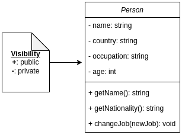
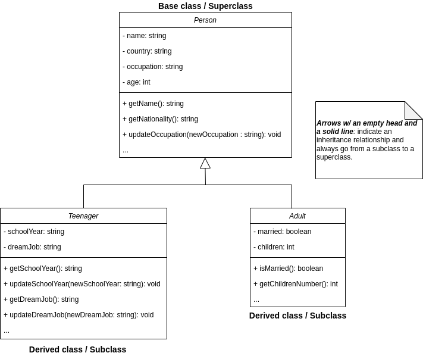

# Motivation

The intent behind the creation of this repository is to document my learning as I try to develop a reasonable understanding about design patterns for software development. And since that is the case, I am unable to assure the total correctness of all the content written.

This repository is _**open for contributions**_.

# Table of Contents

- Object Oriented Programming (OOP)
  - [Basics](#basics)
  - [Pillars](#pillars)
    - [Abstraction](#abstraction)
    - [Encapsulation](#encapsulation)
    - [Inheritance](#inheritance)
    - [Polymorphism](#polymorphism)
- [SOLID Principles](#solid-principles)
- [Creational Design Patterns](#creational-design-patterns)
- [Structural Design Patterns](#structural-design-patterns)
- [Behavioral Design Patterns](#behavioral-design-patterns)
- [References](#references)

# Object Oriented Programming

## Basics

Programming paradigm which focuses on the organization of the software into reusable pieces of code called _`classes`_, based on the grouping of related data and behaviors. Theses classes are user-defined data types that can be thought of as general blueprints or recipes that define the structure for _`objects`_. Objects are concrete instances of classes. They usually have more specifially defined data and they can be used to model real-world objects and/or more abstract entities.

Classes are usually defined in terms of `attributes` and `methods`:

- Attributes represent the state of an object and they are used to store relevant data
- Methods are functions defined inside a class that describe the behaviors of an object

In the UML diagram below, we have a very basic `Person` class which contains a few private attributes and public methods:



Below is a C++ implementation of this class:

```cpp
class Person {
  private:
    string name;
    string country;
    string occupation;
    int age;
  public:
    // constructor:
    Person(string name, string country, string occupation, int age)
      : name{name}, country{country}, occupation{occupation}, age{age} {}
    // destructor:
    ~Person(){}
    // getters:
    string getName(){
      return this->name;
    }
    string getNationality(){
      return this->country;
    }
    // setters:
    void changeJob(const string &newJob){
      this->occupation = newJob;
    }
    ...
};
```

The terms _`public`_ and _`private`_ are called access specifiers. Besides these two, there is also _`protected`_. As the name implies, access specifiers are keywords which define the accessibility of class members, i.e. which class members can be accessed/viewed by the users (code outside the class which declared the attributes/methods) of the class and which ones are to be accessed/seen only internally by the class itself. See below a short description for the specifiers mentioned.

- _`public`_: access is allowed from outside the class;
- _`private`_: access is not allowed from outside the class, internal use only;
- _`protected`_: access is not allowed from outside the class, but inherited classes are allowed access.

In addition to objects, it is also possible to derive other classes from a given class. For cases like this, the original class, the class from which the others are derived, is often called _`base class`_ or _`superclass`_, while the derived classes are called _`subclasses`_. Subclasses inherit the states and behaviors from their _`base class`_ and define only attributes/methods which differ. They can also override the methods inherited, completely replacing the original behavior or just modifying it. A set of classes and subclasses can be represented by its class hierarchy.

To better understand these concepts, let's derive two classes from the `Person` class defined above, the `Teenager` and `Adult` classes. See below a UML diagram representing this class hierarchy.



Both subclasses `Teenager` and `Adult` inherit the methods and attributes from the `Person` class and each one extended the original functionality in their own way.

Below are basic C++ implementations of these classes. Keep in mind that, as done for the previous example, for the sake of simplicity, I've omitted important aspects like data validation.

```cpp
class Teenager : public Person {
  private:
    string schoolYear;
    string dreamJob;
  public:
    Teenager(string schoolYear, string dreamJob)
      : Person(name, country, occupation), schoolYear{schoolYear}, dreamJob{dreamJob} {}

    ~Teenager(){}

    string getSchoolYear(){
      return this->schoolYear;
    }
    string getDreamJob(){
      return this->dreamJob;
    }

    void updateSchoolYear(string newSchoolYear){
      this->schoolYear = newSchoolYear;
    }
    void updateDreamJob(string newDreamJob){
      this->dreamJob = newDreamJob;
    }
    ...
};

class Adult : public Person{
  private:
    boolean married;
    int children;
  public:
    Adult(boolean married, int children)
      : Person(name, country, occupation), married{married}, children{children} {}

    ~Adult(){}

    boolean isMarried(){
      return this->married;
    }
    string getChildrenNumber(){
      return this->children;
    }
    ...
};
```

Notice that, at least in C++, the `inherited` part of the subclass **MUST** be initialized **BEFORE** the subclass is initialized. When a subclass is created, the base class' constructor executes first, then the subclass' constructor is called. However, it's very important to mention the fact that a subclass **DOES NOT** inherit the base class' constructors, destructors, overloaded assignment operators and class `friend` functions. So, in order for the base class attributes to be initialized, the desired constructor must be directly invoked from the derived class. That's what we see in these parts of the code:

```cpp
...
Teenager(string schoolYear, string dreamJob)
      : Person(name, country, occupation), schoolYear{schoolYear}, dreamJob{dreamJob} {}

...
Adult(boolean married, int children)
      : Person(name, country, occupation), married{married}, children{children} {}

...
```

## Pillars

Object Oriented Programming (OOP) relies heavily on a set of four core principles. These are **Encapsulation**, **Abstraction**, **Inheritance** and **Polymorphism**.

### _Encapsulation_

This principle is all about controlling what information is exposed to external parties. In the previous section, I talked about `access specifiers`, here's where they shine.

Encapsulation represents the ability of an object to keep states and behaviors that should not be seen/modified by other objects hidden. This encapsulation is done by making these attributes and methods _`private`_. Thus, in order to be able to interact with the rest of the program, the object exposes only what is relevant to these interactions through _`public`_ methods and `interfaces`.This helps to increase security since it provides a way to avoid that outside parties mess with an object's data unless they are explicitly allowed to. It also makes it easier to collaborate with others without having to worry about compromising sensitive information by hiding all the inner workings.

### _Abstraction_

An abstraction is a model of a real-world object or event, limited to a specific context, focusing on the details which are relevant to said context while omitting the rest. As an example of abstraction, let's think of how we use a coffee machine. We don't really need to know all about its inner workings, its electronics, and the process they perform in order to make coffee. Most of the time it's just a matter of pushing a button. Thus, all the engineering and unnecessary details that are not relevant to the user are hidden, and only an interface (i.e. the button) is exposed, _"abstracting away"_ the complexity.

Similar to what was shown for encapsulation, abstraction uses classes to model real-world scenarios and hides the details behind _`private`_ attributes and methods, exposing only what is relevant through high-level mechanisms such as _`public`_ methods and `interfaces`.

### Inheritance

- child classes inherit data and behaviors from parent class

### Polymorphism

- many methods can do the same task

# **SOLID Principles**

### **S**ingle Responsibility Principle [SRU]

### **O**pen/Closed Principle [OCP]

### **L**iskov Substitution Principle

### **I**nterface Segregation Principle

### **D**ependency Inversion

# **Creational Design Patterns**

### Factory

### Abstract Factory

### Builder

### Prototype

### Singleton

# **Structural Design Patterns**

### Adapter

### Bridge

### Composite

### Decorator

### Facade

### Flyweight

### Proxy

# **Behavioral Design Patterns**

### Chain of Responsibility

### Command

### Iterator

### Mediator

### Memento

### Observer

### State

### Strategy

### Template Method

### Visitor

# References

- [_Dive Into Design Patterns_ by Alexander Shvets](https://refactoring.guru/design-patterns/book)
- [_What is object-oriented programming? OOP explained in depth_ by Erin Doherty](https://www.educative.io/blog/object-oriented-programming)
- _Clean Architecture_ by Robert C. Martin
- [_Design Patterns in Modern C++_ by Dmitri Nesteruk](https://www.udemy.com/course/patterns-cplusplus/)
