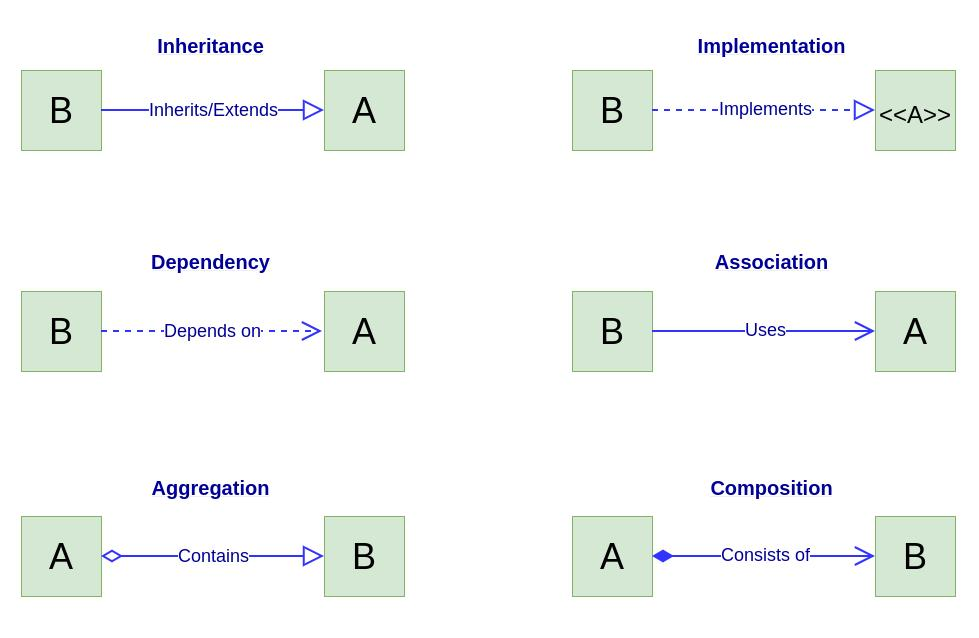

# Motivation

The intent behind the creation of this repository is to document my learning as I try to develop a reasonable understanding about design patterns for software development. And since that is the case, I am unable to assure the total correctness of all the content written.

This repository is _**open for contributions**_.

# Table of Contents

- Object Oriented Programming (OOP)
  - [Basics](#basics)
  - [Pillars](#pillars)
    - [Abstraction](#abstraction)
    - [Encapsulation](#encapsulation)
    - [Inheritance](#inheritance)
    - [Polymorphism](#polymorphism)
  - [Relationships between objects](#relationships-between-objects)
- [Introduction to Design Patterns](#introduction-to-design-patterns)
- [SOLID Principles](#solid-principles)
- [Creational Design Patterns](#creational-design-patterns)
- [Structural Design Patterns](#structural-design-patterns)
- [Behavioral Design Patterns](#behavioral-design-patterns)
- [References](#references)

# Object Oriented Programming (OOP)

## Basics

OOP is a programming paradigm which focuses on the organization of the software into reusable pieces of code called _`classes`_, based on the grouping of related data and behaviors. Theses classes are user-defined data types that can be thought of as general blueprints or recipes that define the structure for _`objects`_. Objects are **concrete** instances of classes. They usually have more specifically defined data and they can be used to model real-world objects and/or more abstract entities.

Classes are usually defined in terms of `attributes` and `methods`:

- Attributes represent the **state** of an object and they are used to store relevant data.
- Methods are functions defined inside a class that describe the **behaviors** of an object.

In the UML diagram below, we have a very basic `Person` class which contains a few private attributes and public methods:


Below is how a C++ implementation of this class could look like:

```cpp
class Person {
  private:
    string name;
    string country;
    string occupation;
    int age;
  public:
    // constructor:
    Person(string name, string country, string occupation, int age)
      : name{name}, country{country}, occupation{occupation}, age{age} {}
    // destructor:
    ~Person(){}
    // getters:
    string getName(){
      return this->name;
    }
    string getNationality(){
      return this->country;
    }
    // setters:
    void changeJob(const string &newJob){
      this->occupation = newJob;
    }
    ...
};
```

The terms _`public`_ and _`private`_ are called access specifiers. Besides these two, there is also _`protected`_. As the name implies, access specifiers are keywords which define the accessibility of class members, i.e. which class members can be accessed/viewed by the users (code outside the class which declared the attributes/methods) of the class and which ones are to be accessed/seen only internally by the class itself. See below a short description for the specifiers mentioned.

- _`public`_: access is allowed from outside the class;
- _`private`_: access is not allowed from outside the class, internal use only;
- _`protected`_: access is not allowed from outside the class, but inherited classes are allowed access.

In addition to objects, it is also possible to derive other classes from a given class. For cases like this, the original class, the class from which the others are derived, is often called _`base class`_ or _`superclass`_, while the derived classes are called _`subclasses`_. Subclasses inherit the states and behaviors from their _`base class`_ and define only attributes/methods which differ. They can also override the methods inherited, completely replacing the original behavior or just modifying it. A set of classes and subclasses can be represented by its class hierarchy.

To better understand these concepts, let's derive two classes from the `Person` class defined above, the `Teenager` and `Adult` classes. See below a UML diagram representing this class hierarchy.


Both subclasses `Teenager` and `Adult` inherit the methods and attributes from the `Person` class and each one extended the original functionality in their own way.

Below are basic C++ implementations of these classes. Keep in mind that, as done for the previous example, for the sake of simplicity, I've omitted important aspects like data validation.

```cpp
class Teenager : public Person {
  private:
    string schoolYear;
    string dreamJob;
  public:
    Teenager(string schoolYear, string dreamJob)
      : Person(name, country, occupation), schoolYear{schoolYear}, dreamJob{dreamJob} {}

    ~Teenager(){}

    string getSchoolYear(){
      return this->schoolYear;
    }
    string getDreamJob(){
      return this->dreamJob;
    }

    void updateSchoolYear(string newSchoolYear){
      this->schoolYear = newSchoolYear;
    }
    void updateDreamJob(string newDreamJob){
      this->dreamJob = newDreamJob;
    }
    ...
};

class Adult : public Person{
  private:
    boolean married;
    int children;
  public:
    Adult(boolean married, int children)
      : Person(name, country, occupation), married{married}, children{children} {}

    ~Adult(){}

    boolean isMarried(){
      return this->married;
    }
    string getChildrenNumber(){
      return this->children;
    }
    ...
};
```

Notice that, at least in C++, the `inherited` part of the subclass **MUST** be initialized **BEFORE** the subclass is initialized. When a subclass is created, the base class' constructor executes first, then the subclass' constructor is called. However, it's very important to mention the fact that a subclass **DOES NOT** inherit the base class' constructors, destructors, overloaded assignment operators and class `friend` functions. So, in order for the base class attributes to be initialized, the desired constructor must be directly invoked from the derived class. That's what we see in these parts of the code:

```cpp
...
Teenager(string schoolYear, string dreamJob)
      : Person(name, country, occupation), schoolYear{schoolYear}, dreamJob{dreamJob} {}

...
Adult(boolean married, int children)
      : Person(name, country, occupation), married{married}, children{children} {}

...
```

[Table of contents](#table-of-contents)

## Pillars

Object Oriented Programming (OOP) relies heavily on a set of four core principles. These are **Encapsulation**, **Abstraction**, **Inheritance** and **Polymorphism**.

### _Encapsulation_

This principle is all about controlling what information is exposed to external parties. In the previous section, I talked about `access specifiers`, here's where they shine.

Encapsulation represents the ability of an object to keep states and behaviors that should not be seen/modified by other objects hidden. This encapsulation is done by making these attributes and methods _`private`_. Thus, in order to be able to interact with the rest of the program, the object exposes only what is relevant to these interactions through _`public`_ methods and `interfaces`.This helps to increase security since it provides a way to avoid that outside parties mess with an object's data unless they are explicitly allowed to. It also makes it easier to collaborate with others without having to worry about compromising sensitive information by hiding all the inner workings.

### _Abstraction_

An abstraction is a model of a real-world object or event, limited to a specific context, focusing on the details which are relevant to said context while omitting the rest. As an example of abstraction, let's think of how we use a coffee machine. We don't really need to know all about its inner workings, its electronics, and the process they perform in order to make coffee. Most of the time it's just a matter of pushing a button. Thus, all the engineering and unnecessary details that are not relevant to the user are hidden, and only an interface (i.e. the button) is exposed, _"abstracting away"_ the complexity.

Similar to what was shown for encapsulation, abstraction uses classes to model real-world scenarios and hides the details behind _`private`_ attributes and methods, exposing only what is relevant through high-level mechanisms such as _`public`_ methods and `interfaces`.

### _Inheritance_

We've touched on this principle previously when discussing the basics of OOP. Inheritance represents the ability to create new classes from existing ones. The main benefit here is **reusability**, thus reducing the amount of duplicated code.

Objects may share a lot of similarities, maybe they have the same attributes or share the same logics. In this way, if the need arises for a class with similar class members to an existing one, instead of repeating the same code over and over, we may simply derive a _`subclass`_ from the existing class (_`parent/base class`_), extending its functionality by adding the missing pieces (new attributes and/or methods). By doing this, the common class members are kept in the _`parent`_ class, while the unique attributes/methods are kept in its _`subclasses`_, so each class adds only what is missing to it while reusing the common logic shared by the _`parent`_ class. This forms a class hierarchy, as seen before.

### _Polymorphism_

By making use of polymorphism, we can have class-specific behavior for the same inherited method (same function signature). This can be achieved by defining the _`parent`_ class as an _`abstract class`_ or _`interface`_. This interface is responsible for outlining the common methods which will be overriden by the _`subclasses`_ to implement their specific versions of it.

The example below shows a simple application of polymorphism. The parent class `Citizen` is an `interface`, created by adding a pure virtual function to a C++ abstract class. The pure virtual function `greet()` must be overriden by each subclass derived from `Citizen` if we want them to be concrete classes and not also interfaces.

```cpp
// abstract class
class Citizen {
    public:
      // pure virtual function, this is what make this class an
      // abstract class and it must be overriden by subclasses:
      virtual void greet(void) const = 0;
};

// each subclass below implement their own version of "greet()"
// by overriding the inherited method:
class Brazilian : public Citizen {
    public:
        virtual void greet(void) const override {
            std::cout << "Olá! Como você está?\n";
        }
};

class Spanish : public Citizen {
    public:
        virtual void greet(void) const override {
            std::cout << "¡Oye! ¿Cómo estás?\n";
        }
};

class German : public Citizen {
    public:
        virtual void greet(void) const override {
            std::cout << "Hallo! Wie geht es dir?\n";
        }
};


int main()
{
    Brazilian* br = new Brazilian();
    br->greet(); // calls the Brazilian class version of greet()

    Spanish* sp = new Spanish();
    sp->greet(); // calls the Spanish class version of greet()

    German* ge = new German();
    ge->greet(); // calls the German class version of greet()

    Citizen* cz = new Brazilian(); // a Brazilian is a Citizen
    cz->greet(); // calls the Brazilian class version of greet()

    // Since subclasses share an 'is-a' relationship with the parent
    // class (i.e. a German is a Citizen, etc), we can add any subclass
    // to the Citizen vector 'ctzs':
    std::vector<Citizen*> ctzs;
    ctzs.push_back(br);
    ctzs.push_back(sp);
    ctzs.push_back(ge);
    ctzs.push_back(cz);

    // Now, polymorphism makes sure that when iterating through all
    // elements of 'ctzs' and calling the "greet()" method, the correct
    // subclass version of it is called without us having to write specific
    // versions of this to each subclass:
    for(auto &ct : ctzs)
        ct->greet();

    return 0;
}
```

[Table of contents](#table-of-contents)

## Relationships between objects



### _Inheritance_

> class B `extends` class A

As mentioned a couple of times above, it's the ability to create new classes from existing ones. Through inheritance, the subclass inherits the common states and behaviors from its base class and adds only those which are specific to itself, thus, avoiding code duplication.

### _Implementation_

> class B `implements` interface A

Interfaces and abstract classes are based on the concepts of abstraction and encapsulation. This mechanism lets you define contracts of interaction between objects and only ever cares about the behaviors of objects.

Note: Subclasses have the same interface as their base class. If a parent class implements an interface, all of its subclasses must also implement it.

### _Dependency_

> class B `depends on` class A

Class B depends on class A if changes to the definition of class A result in the need to also modify class B. It is possible to make a dependency weaker by making the code dependent on interfaces/abstract classes instead of concrete ones.

### _Association_

> object B `uses/interacts with/knows of` object A (`and also depends on` A)

It can be seen as a specialized kind of dependency where an object always has access to the object with which it interacts, whereas simple dependency doesn't establish a permanent link between objects. See the following example:

```cpp
class Travel {
  private:
    Transport transport;
    //...
  public:
    //...
    double calculateEstimatedCost(Route r) {
      return (this->transport.getMPG() * r.getTotalRouteMiles());
    }
};
```

The `calculateEstimatedCost` method above takes as argument an object of class `Route`, which is then used in the calculation inside the method. If there are any changes to `getTotalRouteMiles`, i.e. name changes, argument list, this code is going to break, which characterizes a dependency. Now, if we take a look at the `transport` attribute, it is clearly also a dependency: if the `getMPG` method is modified, it could also potentially break the code. However, since the `transport` method is always accessible to any method belonging to the `Travel` class, it's also an **association** in addition to a **dependency**.

### _Aggregation_

> object A `contains` object B (`and also knows of` B (`and also depends on` B))

Specialized type of association which represents `1-*`, `*-*` or `whole-part` relations between multiple objects. Under this relationship, an object usually "has" a set of other objects and works as a container/collection. Additionally, one component can exist without the container, i.e. the container does not control its life cycle, and can be linked to other containers simultaneously.

### _Composition_

> object A `consists of` object B (`and also knows of` B (`and also depends on` B)) + `manages the life cycle` of B

Specific kind of aggregation where one object is composed of one or more instances of the other. What set composition apart from the other relationships is that the component itself can only exist as part of the container, i.e. `B` can only exists as part of `A`, so `A` controls its life cycle.

[Table of contents](#table-of-contents)

# **Introduction to Design Patterns**

Design patterns are typical solutions to common problems in software design, which can be thought of as pre-made blueprints that you can customize to solve a recurring design problem in your code. However, a pattern is not a specific piece of code, but a general concept for solving a particular problem, thus, the code implementation may differ if the same pattern is applied to different problemms. This is also why they should not be confused to algorithms.

| PATTERNS | vs | ALGORITHMS |
| :-: | :-: | :-: |
| Typical solution to known problems |  | Typical solution to known problems |
| _High-level description of a solution_ |  | _Clear set of actions_ |

## Principles

### Encapsulate what varies

Since most of the time changes are unavoidable and the code will need to be updated at some point, the main purpose of this principle is to minimize the effects caused by said changes. A good practice, then, is to identify and isolate the parts of the code that vary to protect the rest of the code from adverse effects.

> **TODO**: add example.

### Depend on abstractions, not in concrete classes

A design's flexibility can be measured by how much you can extend it without breaking the existing functionality. So, next time, we need to make two classes interact with each other, instead of making one of them depend on the other, we can follow the steps below:

1. Determine what exactly one object needs from the other: which methods does it execute?
2. Describe these methods in a new interface or abstract class.
3. Make the class that is a dependency implement this interface.
4. Now make the second class dependent on this interface rather than on the concrete class. You still can make it work with objects of the original class, but the connection is now much more flexible.

> **TODO**: add example.

### Prefer Composition over Inheritance

# **SOLID Principles**

### **S**ingle Responsibility Principle [SRU]

### **O**pen/Closed Principle [OCP]

### **L**iskov Substitution Principle

### **I**nterface Segregation Principle

### **D**ependency Inversion

# **Creational Design Patterns**

**Purpose**: Provide object creation mechanisms that increase flexibility and reuse of existing code.

### Factory

### Abstract Factory

### Builder

### Prototype

### Singleton

# **Structural Design Patterns**

**Purpose**: Explain how to assemble objects and classes into larger structures, while keeping the structures flexible and efficient.

### Adapter

### Bridge

### Composite

### Decorator

### Facade

### Flyweight

### Proxy

# **Behavioral Design Patterns**

**Purpose**: Take care of effective communication and the assignment of responsibilities between objects.

### Chain of Responsibility

### Command

### Iterator

### Mediator

### Memento

### Observer

### State

### Strategy

### Template Method

### Visitor

# References

Object Oriented Programming (OOP) Basics

- [_Dive Into Design Patterns_ by Alexander Shvets](https://refactoring.guru/design-patterns/book)
- [_What is object-oriented programming? OOP explained in depth_ by Erin Doherty](https://www.educative.io/blog/object-oriented-programming)
- _Clean Architecture_ by Robert C. Martin

- [_How to explain object-oriented programming concepts to a 6-year-old_ by Alexander Petkov](https://www.freecodecamp.org/news/object-oriented-programming-concepts-21bb035f7260/)

SOLID Principles

- [_Design Patterns in Modern C++_ by Dmitri Nesteruk](https://www.udemy.com/course/patterns-cplusplus/)

[Table of contents](#table-of-contents)
